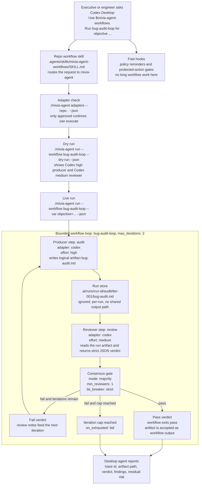

# Mivia AgentKit


Mivia AgentKit is a local Go CLI for installing, validating, and operating a repo-level agent-control surface across Codex, Claude Code, Google Antigravity, GitHub Copilot, and future adapters.

## Quick Start

Install prerequisites from `docs/setup/development-environment.md`.

Run the CLI from this checkout:

```bash
go run ./cmd/mivia-agent --help
```

Preview the agent-control files that `init` would add to a target Git repo:

```bash
go run ./cmd/mivia-agent init --repo /path/to/repo --profile standard \
  --adapter codex --adapter claude --adapter copilot --dry-run
```

Write the files after reviewing the dry run:

```bash
go run ./cmd/mivia-agent init --repo /path/to/repo --profile standard \
  --adapter codex --adapter claude --adapter copilot --write
```

Validate the generated setup:

```bash
go run ./cmd/mivia-agent doctor --repo /path/to/repo --json
```

Review advisory quality gaps:

```bash
go run ./cmd/mivia-agent audit --repo /path/to/repo --json
```

## Codex Desktop Flow

In a Codex Desktop repo, `mivia-agent init` installs the repo skill, hook wiring, manifest, and workflow files. The desktop agent still starts from a normal user prompt, but the runtime boundary is the local `mivia-agent` binary. A workflow is not just a prompt: it is a bounded produce-review loop with adapter detection, configured effort levels, run-local artifacts, consensus, and explicit pass/fail/iterate behavior.



Example desktop prompt:

```text
Use $mivia-agent-workflows. Check adapters, dry-run workflow bug-audit-loop, then run it for objective: find correctness and reliability bugs in the adapter runtime.
```

For a Codex-only runtime setup, configure Codex as the orchestrable adapter and keep desktop-only tools such as Antigravity guidance-only. The workflow files should resolve producer and reviewer steps to `codex` in the dry-run output before any live run.

This repo includes Codex-only workflows for its own maintenance:

| Workflow | Producer | Reviewer | Output |
| --- | --- | --- | --- |
| `research-loop` | Codex `low` | Codex `medium` | `research.md` |
| `bug-audit-loop` | Codex `high` | Codex `medium` | `bug-audit.md` |
| `roadmap-implementation-review-loop` | Codex `high` | Codex `xhigh` | `roadmap-review.md` |
| `desktop-workflow-docs-loop` | Codex `medium` | Codex `high` | `desktop-workflow-docs.md` |

## Current Capabilities

Implemented command surface:

- `init`: install the `.ai/` control surface and selected adapter files.
- `doctor`: validate generated setup and manifest wiring.
- `audit`: report advisory quality gaps.
- `preflight`: write a `.git/mivia-agent-quality-stamp.json` stamp for the current diff.
- `adapters`: detect local adapters and whether they are approved for orchestrated runs.
- `run`: execute a bounded workflow from `mivia-agent.yaml` or `.ai/workflows/*.yaml`.
- `review`: run a one-off consensus review for an artifact.
- `hook`: enforce hook policy for Codex and Claude events.
- `import`: inspect an existing setup and map reusable content into `.ai/`.
- `update`: refresh managed template blocks while preserving user content outside managed regions.
- `version`: print the CLI version.

Current adapter behavior:

- `codex`: orchestrable.
- `claude`: orchestrable.
- `antigravity`: orchestrable via the `agy` binary.
- `copilot`: guidance-only template surface, not an orchestrated runtime adapter.
- `crush`: orchestrable when `crush run --help` confirms noninteractive `run` support.

Some flags already exist on the CLI but are not fully wired yet:

- `init --with-loop`
- `run --step`
- `run --input-artifact`
- `preflight --pipeline-preflight`

Treat those as reserved surface for now.

## Command Summary

| Command | What it does | Key flags |
| --- | --- | --- |
| `init` | Install canonical files into a repo | `--repo`, `--profile`, `--adapter`, `--dry-run`, `--write`, `--force`, `--json` |
| `doctor` | Validate setup and manifest | `--repo`, `--json`, `--strict` |
| `audit` | Report advisory quality gaps | `--repo`, `--json`, `--strict` |
| `preflight` | Write a quality stamp | `--repo`, `--contract-row`, `--focused-verifier`, `--broad-verifier`, `--mutation-proof`, `--not-run`, `--json` |
| `adapters` | Report adapter install/headless/run status | `--repo`, `--json` |
| `run` | Execute a bounded workflow | `--repo`, `--workflow`, `--max-iterations`, `--dry-run`, `--json`, `--strict` |
| `review` | Run one-off consensus review | `--repo`, `--artifact`, `--reviewers`, `--mode`, `--min-reviewers`, `--weights`, `--tie-breaker`, `--json` |
| `hook` | Enforce hook decisions for Codex or Claude | `--repo` plus subcommands `codex` and `claude` |
| `import` | Plan or apply `.ai/` migration | `--repo`, `--write`, `--force`, `--json` |
| `update` | Refresh managed template content | `--repo`, `--write`, `--force`, `--json` |

## Examples

Initialize a repo:

```bash
go run ./cmd/mivia-agent init --repo /path/to/repo --profile standard \
  --adapter codex --adapter claude --adapter copilot --dry-run
```

Write the files:

```bash
go run ./cmd/mivia-agent init --repo /path/to/repo --profile standard \
  --adapter codex --adapter claude --adapter copilot --write
```

Write a quality stamp:

```bash
go run ./cmd/mivia-agent preflight --repo /path/to/repo \
  --contract-row hooks \
  --focused-verifier "go test ./internal/cli/... -count=1" \
  --broad-verifier "go test ./... -count=1" \
  --mutation-proof "drop protected-action guard fails"
```

Inspect adapter status:

```bash
go run ./cmd/mivia-agent adapters --repo /path/to/repo --json
```

Preview a Crush/Qwen producer with Codex review:

```bash
go run ./cmd/mivia-agent run --repo /path/to/repo \
  --workflow crush-research-loop --dry-run --json
go run ./cmd/mivia-agent run --repo /path/to/repo \
  --workflow crush-research-loop \
  --var objective="collect repo context for the billing refactor" --json
```

Preview a workflow plan without invoking adapters:

```bash
go run ./cmd/mivia-agent run --repo /path/to/repo --workflow research --dry-run --json
```

In desktop apps, ask the agent to use the generated workflow skill:

```text
Use $mivia-agent-workflows. Run workflow research-loop for objective: audit auth timeout handling.
```

Run a one-off review:

```bash
go run ./cmd/mivia-agent review --repo /path/to/repo \
  --artifact internal/cli/root.go \
  --reviewers codex,claude \
  --mode majority \
  --json
```

Plan an import from an existing setup:

```bash
go run ./cmd/mivia-agent import --repo /path/to/repo --json
```

Apply the import:

```bash
go run ./cmd/mivia-agent import --repo /path/to/repo --write
```

Refresh managed files after upgrading the binary:

```bash
go run ./cmd/mivia-agent update --repo /path/to/repo --write
```

Hook example:

```bash
printf '{"tool":"bash","command":"git push"}' | \
  go run ./cmd/mivia-agent hook codex pre-tool-use --repo /path/to/repo
```

## Notes

`init` is idempotent for the same inputs. Existing user-owned files with different content are reported as conflicts and are not overwritten unless `--force` is passed. Files with `mivia-agent` managed-block markers are updated only inside the managed block.

`doctor` is read-only. It checks the manifest, `.ai/` index, adapter files, hook wiring, skill frontmatter, managed-block markers in generated/control files, loop bounds, consensus satisfiability, and governance provider. In `--strict` mode it also reports project/global rule conflicts as warnings, and `--strict` promotes warnings to failures.

`audit` is read-only and advisory by default. It flags duplicated policy, missing control checks, missing verifier or contract surfaces, unsafe MCP wildcard config, managed-file edits outside generated blocks, weak strict-profile consensus, protect-bound loops without review, and global rule conflicts.

Install hooks and run the local gate:

```bash
make install-hooks
make verify
```

See available targets:

```bash
make help
```

## Docs

- [User guide](docs/user-guide.md) - current command surface, flags, behavior notes, and examples
- [Configuration examples](docs/config-examples.md) - working manifest and workflow examples, including Codex plus Crush/Qwen loops
- [Loop authoring](docs/loop-authoring.md) - workflow shape, consensus, artifact paths, and practical checks
- [Desktop agent workflows](docs/desktop-agent-workflows.md) - how Codex, Claude, and generic agent desktops should use skills and hooks to invoke `mivia-agent`
- [Mivia workflow skill](.ai/skills/mivia-agent-workflows/SKILL.md) - repo skill with copy-paste desktop prompts and runtime proof rules
- [Development environment](docs/setup/development-environment.md) - local prerequisites and Ubuntu setup
- [Development hooks](docs/development-hooks.md) - hook behavior and policy shape
- [Agent hooks](docs/agent-hooks.md) - agent hook surfaces, triggers, policies, and audit-loop behavior
- [Agent planning](docs/agent-planning.md) - DAG planning skill, machine plan contract, and implementation hooks


